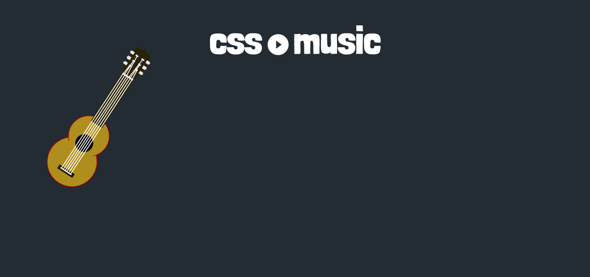

<div align="center">

</div>

<h1 align="center">This project was made to join two things that i love. <br> Music and Web Development</h1>

# 🚀 How to run
## This project was uploaded [right here][cssMusic], if you want to run in your machine, follow these steps.
## You will need [Node][nodejs] pre-installed.
```bash
# First clone the repository
$ git clone https://github.com/brunofow/css-music.git

# Then enter in the project directory and run
$ cd css-music && npm run dev
# if you are using yarn
$ cd css-music && yarn dev
```


[cssMusic]: https://css-music.vercel.app/
[nodejs]: https://nodejs.org/en/